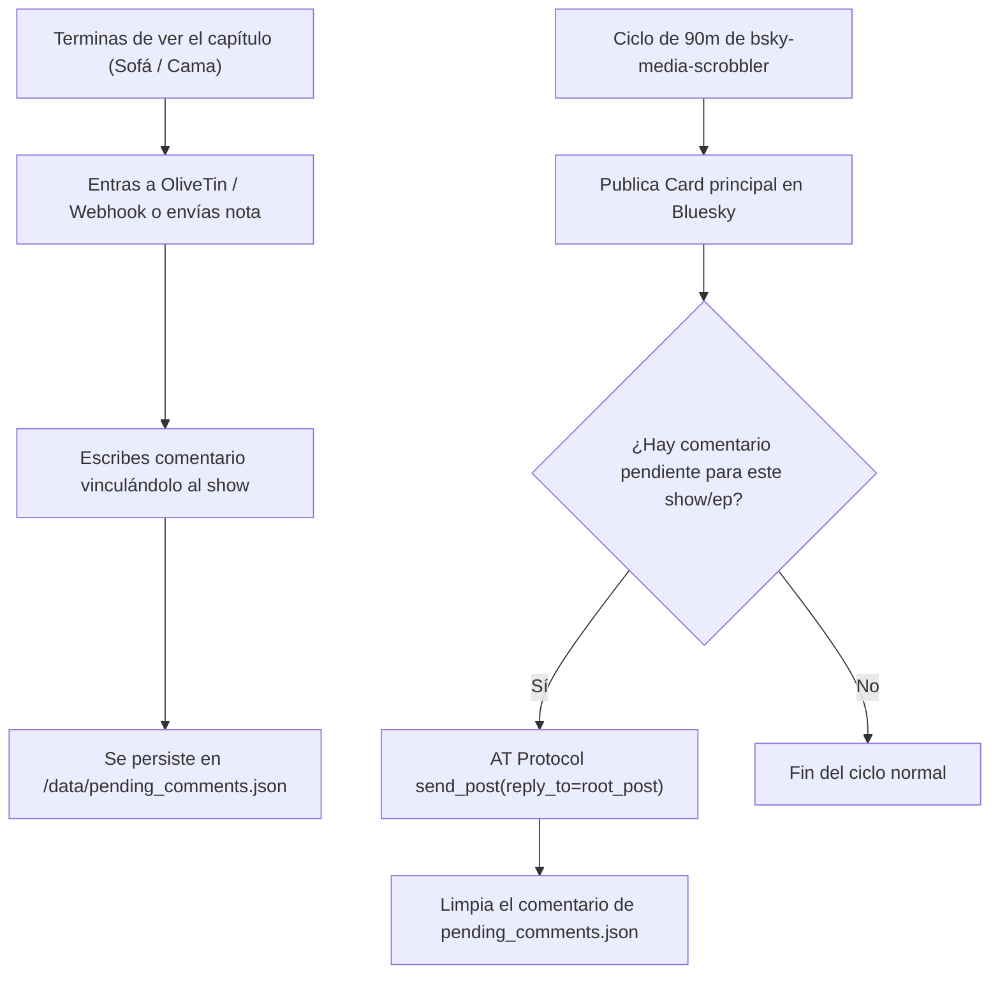
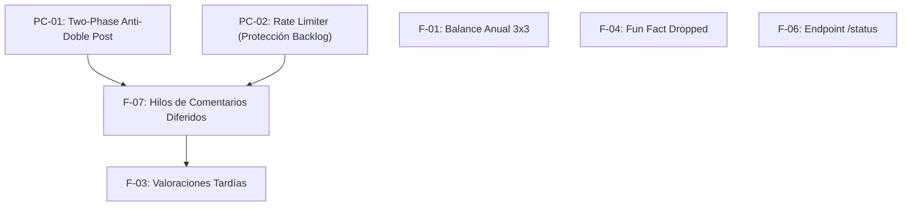

# 🗺️ Roadmap y Especificación Técnica — `bsky-media-scrobbler`

> **Documento de Arquitectura y Especificación de Desarrollo**  
> **Versión base:** `v1.0.0` (Commit `5359396`) · **Última revisión:** 1 de octubre de 2026  
> Este documento contiene los contratos de datos, algoritmos, casos borde y guías paso a paso para que cualquier desarrollo futuro se implemente con precisión sin ambigüedades.

---

## 📑 Índice de Contenidos

1. [Arquitectura del Modo Thread: Comentarios Diferidos (F-07)](#1-f-07--cola-de-comentarios-pendientes-y-modo-thread-diferido)
2. [Garantía Transaccional y Anti-Doble Post (PC-01)](#2-pc-01--garantía-transaccional-anti-doble-post)
3. [Rate Limiter y Control de Inundación (PC-02 / F-02)](#3-pc-02--f-02--rate-limiter-y-control-de-inundación)
4. [Balance Anual Seriéfilo con Collage 3×3 (F-01)](#4-f-01--balance-anual-seriéfilo-con-collage-33)
5. [Detección y Publicación de Valoración Explícita (F-03)](#5-f-03--publicación-de-valoración-explícita-a-posteriori)
6. [Fun Fact: El Cementerio de Series Dropped (F-04)](#6-f-04--fun-fact-el-cementerio-de-series-dropped)
7. [Micro-Endpoint de Salud y Telemetría `/status` (F-06)](#7-f-06--micro-endpoint-de-salud-y-telemetría-status)
8. [Correcciones de Robustez Menores (PC-03, PC-04, PC-05)](#8-correcciones-de-robustez-menores)
9. [Matriz de Prioridades y Dependencias](#9-matriz-de-prioridades-y-dependencias)

---

## 1. F-07 — Cola de Comentarios Pendientes y Modo Thread Diferido

### 1.1. El Problema Operativo
El bot funciona con ciclos de 90 minutos para agrupar maratones. Si terminas de ver un capítulo a medianoche:
* No quieres esperar despierto hasta la 01:15 para ver la publicación en Bluesky y editarla/responder.
* No quieres tener que acordarte a la mañana siguiente de buscar el post para comentar.
* Necesitas **escribir la reflexión justo al terminar de ver la pantalla**, que quede vinculada al capítulo y que se publique sola en hilo cuando venza la ventana de 90 minutos.

### 1.2. Flujo de Datos y Arquitectura



### 1.3. Estructura de `pending_comments.json`
Archivo persistente en `/data/pending_comments.json`:

```json
{
  "comments": [
    {
      "id": "c1a2b3c4",
      "show_title": "Severance",
      "season": 2,
      "episode": 1,
      "match_mode": "episode",
      "text": "Menudo regreso. La tensión del ascensor y la dirección artística siguen a un nivel estratosférico.",
      "created_at": "2026-10-01T23:45:10Z",
      "ttl_hours": 24
    },
    {
      "id": "d5e6f7g8",
      "show_title": "The Penguin",
      "match_mode": "latest_show",
      "text": "Colin Farrell está irreconocible. El final de temporada es demoledor.",
      "created_at": "2026-10-01T23:55:00Z",
      "ttl_hours": 24
    }
  ]
}
```

* `match_mode: "episode"`: Se vincula exactamente al capítulo indicado. Si se emite un maratón `S02E01-E03`, el comentario de `E01` o `E03` se acopla al post agrupado.
* `match_mode: "latest_show"`: Comodín rápido: se acopla al próximo post que se publique de esa serie, sin importar el número de capítulo exacto.

### 1.4. Interfaz de Usuario: Integración con OliveTin / Webhook
En OliveTin (o interfaz web ligera) se crea una acción con dos campos:
1. **Serie / Película:** Campo de texto (o desplegable precargado con los últimos 3 visionados vía script rápido).
2. **Tu comentario:** Área de texto multilínea.
3. **Casilla opcional:** *«Publicar inmediatamente (forzar sync sin esperar los 90m)»* → si está marcada, tras guardar la nota ejecuta `touch /data/trigger_sync`.

### 1.5. Modificaciones en el Código (`app/bsky.py` y `app/main.py`)
1. **`app/bsky.py`:**
   * `post_watch()` actualmente retorna un booleano. Debe retornar el objeto completo de respuesta o una tupla `(success: bool, post_uri: str, post_cid: str)`.
   * Añadir método `post_reply(text: str, root_uri: str, root_cid: str, parent_uri: str = None, parent_cid: str = None) -> bool`:
     ```python
     reply_ref = models.AppBskyFeedPost.ReplyRef(
         root=models.ComAtprotoRepoStrongRef.Main(uri=root_uri, cid=root_cid),
         parent=models.ComAtprotoRepoStrongRef.Main(
             uri=parent_uri or root_uri, 
             cid=parent_cid or root_cid
         )
     )
     self.client.send_post(text=text, reply_to=reply_ref)
     ```
2. **`app/main.py`:**
   * Tras publicar el post principal en `process_shows()` o `process_movies()`, consultar si hay comentarios en `/data/pending_comments.json` coincidentes por `show_title` y rango de episodios.
   * Si existe coincidencia: publicar el reply en hilo con 2 segundos de pausa y purgar la entrada del JSON.

---

## 2. PC-01 — Garantía Transaccional Anti-Doble Post

### 2.1. El Problema
Actualmente el flujo es:
`POST a Bluesky` ➔ `storage.add_announced([keys])` ➔ `storage.save()`

Si el proceso muere, el contenedor se reinicia o el kernel detiene el proceso por OOM entre el POST y el guardado en disco, la clave **no se guarda** y en el siguiente ciclo el post **se publica dos veces**.

### 2.2. Solución: Patrón Two-Phase en `state.json`
Modificar el esquema de `state.json` añadiendo la cola transaccional `"pending_publication"`:

```json
{
  "announced": ["shows:1234:1:1", "..."],
  "in_flight": {
    "keys": ["shows:1234:1:2"],
    "attempted_at": "2026-10-01T11:05:00Z"
  }
}
```

### 2.3. Algoritmo
1. **Antes de llamar a Bluesky:**
   * `storage.stage_in_flight(group_keys)` ➔ Escribe atómicamente en disco que esas claves están en proceso.
2. **Llamada a Bluesky:**
   * `success = bsky.post_watch(...)`
3. **Tras respuesta:**
   * Si `success`: `storage.commit_in_flight()` ➔ Mueve `in_flight` a `announced` y limpia `in_flight`.
   * Si falla de red (timeout / 5xx): `storage.rollback_in_flight()` ➔ Limpia `in_flight` para que vuelva a evaluarse.
4. **Al arrancar el contenedor (`main.py:main()`):**
   * Inspeccionar si quedó algún `in_flight` huérfano. Si han pasado más de 10 minutos desde `attempted_at`, verificar contra la API de Bluesky si el post llegó a crearse (o registrar alerta y limpiar).

---

## 3. PC-02 / F-02 — Rate Limiter y Control de Inundación

### 3.1. El Problema
Si el NAS estuvo apagado un fin de semana o se cambia de tracker, el bot puede acumular 40 episodios pendientes. Publicarlos en un solo ciclo inunda el feed de Bluesky y activa las alertas de spam del protocolo AT.

### 3.2. Especificación Técnica
* Variable de entorno: `MAX_POSTS_PER_RUN=${MAX_POSTS_PER_RUN:-6}`
* Variable de entorno: `POST_DELAY_SECONDS=${POST_DELAY_SECONDS:-5}`
* Si hay 20 episodios que forman 8 grupos de publicación y `MAX_POSTS_PER_RUN=5`:
  1. Se publican los **primeros 5 grupos** más antiguos respetando el orden cronológico.
  2. Los 3 grupos restantes **permanecen sin marcar como anunciados**.
  3. El bot programa el siguiente ciclo inmediatamente o reduce el intervalo a 5 minutos (`FAST_RECOVERY_MODE`) hasta vaciar el backlog.
* **Excepción estricta:** Los balances periódicos (semanales, mensuales, anuales) no consumen el cupo de scrobbles normales; tienen su propio canal prioritario.

---

## 4. F-01 — Balance Anual Seriéfilo con Collage 3×3

### 4.1. Calendario y Trigger
* **Publicación automática:** Día **1 de enero** a partir de las **10:00 AM** (hora local del NAS).
* **Marcador en `state.json`:** `last_stats_posted.yearly = "2026"`
* **Trigger bajo demanda:** Archivo `/data/trigger_yearly` para forzar la generación y publicación de prueba en cualquier momento.

### 4.2. Algoritmo de Cálculo Temporal
* `end_dt`: `(1 de enero 00:00:00) - 1 microsegundo` del año en curso ➔ `31 de diciembre 23:59:59` del año evaluado.
* `start_dt`: `1 de enero 00:00:00` del año evaluado.
* Rango: Todo el año natural cerrado (ej. `2026-01-01T00:00:00Z` a `2026-12-31T23:59:59Z`).

### 4.3. Métricas y Collage
1. **Total de episodios vistos** en el año natural.
2. **Total de películas vistas**.
3. **Tiempo total acumulado en pantalla** (horas y días equivalentes).
4. **Top 3 de series más devoradas** del año con recuento exacto de episodios.
5. **Top 1 película** más destacada o mejor valorada.
6. **Total de series cerradas al 100% (completadas)** durante el año.
7. **Collage 3×3 (9 carátulas):**
   * Hasta 4 películas (las más representativas del año).
   * 5 series con mayor volumen de episodios devorados.

### 4.4. Plantilla de Texto (Respetando el límite de 300 caracteres)
```
📊 Balance Anual Seriéfilo 2026

📺 {total_eps} episodios | 🎬 {movies_count} películas
⏳ {total_hours}h ({total_days} días) dedicados a la ficción
🏆 Serie del año: {top_show} ({top_show_eps} caps)
🏁 {completed_shows_count} series completadas al 100%

¿Cuál ha sido vuestra serie del año? 🍿✨
#ResumenAnual #Series #Cine #SIMKL #TMDB
```

---

## 5. F-03 — Publicación de Valoración Explícita a Posteriori

### 5.1. Justificación
Muchos usuarios no puntúan la serie mientras la ven, sino días o semanas después tras reposarla en la app de SIMKL/WeTrakr. Actualmente, si una serie ya fue anunciada, cualquier nota posterior se ignora para siempre.

### 5.2. Diseño de Persistencia en `state.json`
Añadir sección `"ratings_cache"`:
```json
{
  "ratings_cache": {
    "shows:18432": {
      "rating": 9,
      "updated_at": "2026-10-01T15:30:00Z",
      "announced": true
    }
  }
}
```

### 5.3. Algoritmo de Detección
En cada ciclo de comprobación:
1. Al obtener los ítems recientes o el sumario de la cuenta, comparar `user_rating`.
2. Si `item_id` está en `ratings_cache`:
   * Si `current_rating != cached_rating` y `current_rating >= 8` (notas destacadas) o `current_rating <= 4` (notas polémicas/bajas):
     * Generar post de reseña:
       ```
       ⭐ Valoración: Le he puesto un {rating}/10 a {title}.
       {frase_dinámica_de_opinión}
       #Valoración #{hashtag_serie} #SIMKL
       ```
     * Actualizar `ratings_cache[item_id] = current_rating`.
3. Si no estaba en caché: inicializar silenciosamente sin publicar si es histórico antiguo.

---

## 6. F-04 — Fun Fact: El Cementerio de Series Dropped

### 6.1. Justificación
Aporta frescura al ciclo de curiosidades mensuales (día 15 del mes). El usuario quiere visibilizar las series abandonadas sin adulterar las estadísticas de series vistas.

### 6.2. Implementación de Consulta
* **WeTrakr:** Llamada directa al endpoint ya implementado en el cliente: `wetrakr.get_dropped_shows()`.
* **SIMKL:** Filtrado en el historial completo de ítems con `status in ("dropped", "notinteresting", "abandoned")`.

### 6.3. Métricas del Post
1. Total de series abandonadas en el historial.
2. **La serie más sufrida (La que más episodios aguantó antes del abandono):**
   * `max(dropped_shows, key=lambda s: s.get("watched_episodes_count", 0))`
3. **El abandono más rápido:**
   * Primera serie descartada con solo 1 o 2 episodios vistos.

---

## 7. F-06 — Micro-Endpoint de Salud y Telemetría `/status`

### 7.1. Justificación
Permite conocer el estado del scrobbler desde OliveTin, dashboards personales (como Homepage) o monitores externos sin tener que abrir Dockge ni leer logs de terminal.

### 7.2. Arquitectura: Servidor Embebido Ligero
En lugar de dependencias pesadas, utilizar el servidor HTTP nativo de Python en un hilo secundario (`threading.Thread`) que corre dentro de `main.py`:

```python
from http.server import HTTPServer, BaseHTTPRequestHandler
import json

class StatusHandler(BaseHTTPRequestHandler):
    def do_GET(self):
        if self.path == "/status":
            self.send_response(200)
            self.send_header("Content-Type", "application/json")
            self.end_headers()
            status_data = {
                "status": "healthy",
                "provider": TRACKER_PROVIDER,
                "streak_days": storage.get_streak_data().get("current_streak", 0),
                "last_checked": storage.data.get("last_checked", {}),
                "total_announced": len(storage.get_announced()),
                "pending_comments": len(load_pending_comments()),
            }
            self.wfile.write(json.dumps(status_data).encode("utf-8"))
```
* **Puerto interno:** `8080` (o configurable en `.env` como `STATUS_PORT`).
* **Dockge / Compose:** Exponer solo si se desea acceso local o añadirlo a la red `my_network`.

---

## 8. Correcciones de Robustez Menores

### 8.1. PC-03 — Deduplicación cruzada Anime / Series en SIMKL
* **Problema:** Un anime puede retornar en `get_all_items("shows")` y en `get_all_items("anime")`. Como la clave incluye el prefijo (`shows:ID:S:E` vs `anime:ID:S:E`), se duplica el post.
* **Fix:** En SIMKL, la clave de anunciados debe normalizarse a `tv:{simkl_id}:{season}:{episode}` para ambas categorías.

### 8.2. PC-04 — Rotación Justa de Fun Facts
* **Problema:** `now.month % 3` hace que Octubre siempre sea el Tema 1, Noviembre el Tema 2, etc.
* **Fix:** Guardar en `state.json` el índice del último tema publicado (`last_fun_fact_topic: int`). En cada ejecución, seleccionar `(last_fun_fact_topic + 1) % TOTAL_TOPICS`.

### 8.3. PC-05 — Alerta Pushover de Token Expirado
* **Problema:** Si el `refresh_token` queda revocado, el bot entra en bucle de error sin avisar.
* **Fix:** Si `refresh_access_token()` retorna `False` y se agotan los reintentos, llamar a la notificación de emergencia del sistema:
  `/usr/local/bin/python3 /Users/Hector/.local/bin/notify_pushover.py "🚨 ALERTA: Token de sesión de SIMKL/WeTrakr revocado. Se requiere reautenticación manual."`

---

## 9. Matriz de Prioridades y Dependencias



| Tarea | Impacto | Complejidad | Archivos Implicados | Versión |
| :--- | :--- | :--- | :--- | :--- |
| **F-07: Comentarios Diferidos** | ⭐ Alto (UX nocturna) | Media | `bsky.py`, `main.py`, OliveTin | **v1.1** |
| **F-01: Resumen Anual** | ⭐ Alto (Social) | Baja-Media | `stats.py`, `collage.py` | **v1.1** |
| **PC-01 / PC-02: Transacción & Rate Limit** | 🛡️ Estabilidad crítica | Media | `storage.py`, `main.py` | **v1.1** |
| **PC-03 / 04 / 05: Robustez** | 🛡️ Mantenimiento | Baja | `simkl.py`, `stats.py` | **v1.1** |
| **F-03: Valoraciones Tardías** | 📈 Engagement | Media | `storage.py`, `main.py` | **v1.2** |
| **F-04: Cementerio Dropped** | 💡 Curiosidad | Baja | `stats.py` | **v1.2** |
| **F-06: Endpoint `/status`** | ⚙️ Observabilidad | Baja | `main.py` | **v1.2** |

---

*Documento técnico de referencia para el repositorio `bsky-media-scrobbler`.*
