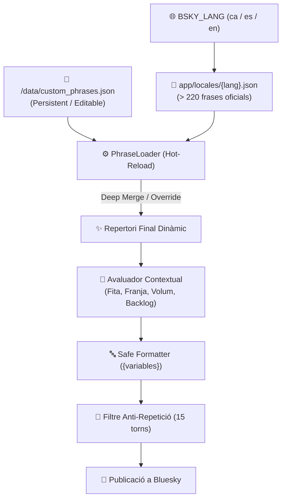

# ✍️ Motor de Frases Personalitzades i Multi-idioma (i18n)

`bsky-media-scrobbler` compta amb un motor dinàmic de redacció amb suport natiu per a **múltiples idiomes** i **frases personalitzades** de l'usuari amb **recàrrega en calent** (zero temps d'inactivitat, sense reiniciar el contenidor).

---

## 🏗️ Arquitectura del Sistema



1. **Catàleg Base (`app/locales/`):**
   * Conté els paquets oficials de frases organitzats per categories.
   * `locales/ca.json` (Català), `locales/es.json` (Espanyol) i `locales/en.json` (Anglès).
2. **Capa Personalitzada (`/data/custom_phrases.json`):**
   * Ubicada al volum de dades persistent. Queda protegida contra actualitzacions del codi o pulls de Git.
   * Modificable des de qualsevol editor de text o app mòbil.
3. **Recàrrega en Calent (`Hot-Reload`):**
   * El scrobbler verifica la data de modificació (`mtime`) del fitxer en mil·lisegons. Tan bon punt desis el fitxer, els canvis tenen efecte a la següent publicació sense reiniciar Docker.

---

## 📝 Variables Disponibles per a Plantilles

Pots redactar qualsevol frase utilitzant marcadors de posició `{variable}`. El formatador utilitza interpolació segura, per la qual cosa una variable inexistent o mal escrita no provocarà errors.

### Variables en Sèries (`shows`)
| Variable | Descripció | Exemple |
| :--- | :--- | :--- |
| `{show_title}` | Nom de la sèrie | `Separació`, `The Bear` |
| `{range_label}` | Codi de l'episodi o rang de marató | `T2E05`, `T1E01-E03` |
| `{season_num}` | Número de la temporada actual | `2` |
| `{first_ep}` | Primer episodi vist a la sessió | `1` |
| `{last_ep}` | Últim episodi vist a la sessió | `3` |
| `{ep_count}` | Total d'episodis vistos a la sessió | `3` |
| `{user_rating}` | La teva nota sobre 10 (si l'has qualificada) | `9.5` |
| `{months}` | Mesos que la sèrie va estar en pausa (en rescats de backlog) | `22` |
| `{years}` | Anys que la sèrie va estar en pausa | `1.8` |
| `{tracker_name}` | Nom de la plataforma de seguiment | `WeTrakr`, `SIMKL` |

### Variables en Pel·lícules (`movies`)
| Variable | Descripció | Exemple |
| :--- | :--- | :--- |
| `{movie_title}` | Títol de la pel·lícula | `Dune: Part 2` |
| `{year}` | Any d'estrena de la pel·lícula | `2024` |
| `{year_str}` | Any formatat entre parèntesis | ` (2024)` |
| `{user_rating}` | La teva nota sobre 10 | `9` |
| `{tracker_name}` | Nom de la plataforma de seguiment | `WeTrakr`, `SIMKL` |

---

## 🎨 Modes d'Ús a `custom_phrases.json`

### Mode A: Mode Suma (Per defecte)
Les frases que defineixis s'afegeixen a les existents al sistema, ampliant la varietat orgànica de les teves publicacions:

```json
{
  "shows": {
    "finale": [
      "🏆 S'ha acabat el bròquil amb {show_title} (T{season_num}). Quin desenllaç!",
      "🎬 Enllestida la temporada {season_num} de {show_title}. Qui més l'ha vista?"
    ],
    "volume": {
      "mega_4": [
        "🔥 Tip d'episodis llegendari de {show_title} ({range_label})! Sense frens."
      ]
    },
    "general": [
      "🍿 Enganxat a tope amb {show_title} ({range_label})",
      "✨ Dosi diària de {show_title} ({range_label})"
    ]
  },
  "movies": {
    "top_rating": [
      "🌟 Quina obra d'art irrepetible: {movie_title}{year_str}"
    ],
    "general": [
      "🎬 Una altra pel·lícula per a la saca: {movie_title}{year_str}"
    ]
  },
  "engagement_questions": {
    "finale": [
      "L'heu vista? Quina nota li poseu vosaltres? 👇"
    ]
  }
}
```

### Mode B: Mode Reemplaçament Exclusiu (`replace`)
Si vols que una o diverses categories utilitzin **únicament les teves frases** i descartin completament les predeterminades, afegeix les seves rutes a la llista `"replace"`:

```json
{
  "replace": [
    "shows.finale",
    "movies.top_rating"
  ],
  "shows": {
    "finale": [
      "🏆 [El Meu Canal] Final de temporada oficial: {show_title} (T{season_num})"
    ]
  },
  "movies": {
    "top_rating": [
      "💎 Joia absoluta del cinema: {movie_title}{year_str} ({user_rating}/10)"
    ]
  }
}
```

---

## 🗂️ Categories Disponibles

### 1. Sèries (`shows`)
* `finale`: Finals de temporada (acompanyats de valoració i pregunta d'engagement).
* `caught_up`: Sèries al dia amb l'emissió setmanal:
  * `single_1`: 1 episodi vist.
  * `double_2`: 2 episodis.
  * `triple_3`: 3 episodis.
  * `marathon_4`: 4 o més episodis.
* `backlog_rescue`: Rescat de sèries després de més d'1.5 anys (547 dies) sense veure cap capítol.
* `volume`: Sessions segons volum:
  * `double_2`: 2 capítols seguits.
  * `triple_3`: 3 capítols.
  * `mega_4`: 4 o més capítols (marató/atracó).
* `season_milestones`:
  * `show_premiere`: Inici de sèrie nova (T1E01).
  * `season_premiere`: Inici de nova temporada (T>1E01).
  * `penultimate`: Penúltim episodi de la temporada.
  * `final_stretch`: Recta final de la temporada.
  * `mid_season`: Equador de la temporada.
* `time_of_day`: Matinada (`night`), matí (`morning`), sobretaula (`afternoon`) i nit (`evening`).
* `day_of_week`: Dilluns (`monday`), entre setmana (`midweek`), divendres (`friday`), dissabte (`saturday`), diumenge (`sunday`).
* `general`: Fons de catàleg general continu.

### 2. Pel·lícules (`movies`)
* `top_rating`: Puntuacions d'obra mestra (`>= 8.5/10`).
* `low_rating`: Puntuacions fluixes (`<= 5/10`).
* `era`:
  * `classic`: Pel·lícules clàssiques anteriors a l'any 2000.
  * `recent`: Estrenes de l'any en curs o anterior.
* `time_of_day`: Matinada (`night`), sobretaula (`afternoon`), nit (`evening`).
* `weekend`: Sessions de cap de setmana.
* `general`: Repertori general.

### 3. Preguntes de Conversa (`engagement_questions`)
* `finale`: Preguntes per interactuar en finalitzar una temporada.
* `top_movie`: Preguntes en veure una pel·lícula destacada.
* `weekly`: Preguntes al peu del balanç setmanal.
* `monthly`: Preguntes al peu del balanç mensual.
* `streak`: Preguntes en desbloquejar una nova ratxa.
