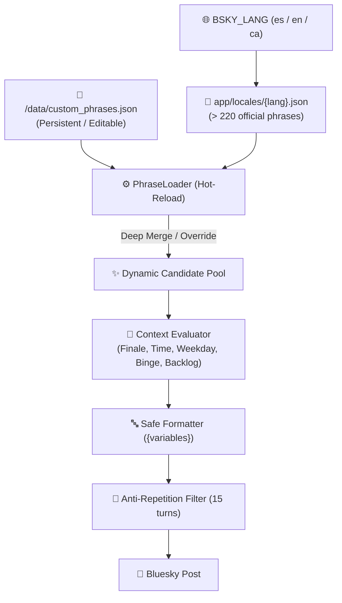

# ✍️ Custom Phrases & Multi-Language (i18n) Engine

`bsky-media-scrobbler` features a dynamic phrasing engine with native support for **multiple languages** and **user custom phrases** with **hot-reloading** (zero downtime, no container restarts needed).

---

## 🏗️ Architecture Overview



1. **Base Catalog (`app/locales/`):**
   * Pre-packaged official phrasing collections organized into logical categories.
   * `locales/es.json` (Spanish), `locales/en.json` (English), `locales/ca.json` (Catalan).
2. **Persistent User Layer (`/data/custom_phrases.json`):**
   * Stored in your persistent `/data` volume outside the codebase. Protected against Git pulls and image updates.
   * Directly editable with any text editor or mobile app.
3. **Hot-Reloading:**
   * The scrobbler checks the file modification time (`mtime`) on every post cycle. Any edits take effect immediately on the next post without container restart.

---

## 📝 Available Template Variables

You can craft phrases using standard `{variable}` placeholders. Safe interpolation guarantees that unknown or misspelled placeholders will not crash the scrobbler.

### TV Show Variables (`shows`)
| Variable | Description | Example |
| :--- | :--- | :--- |
| `{show_title}` | Title of the TV show | `Severance`, `The Bear` |
| `{range_label}` | Episode code or binge range | `S02E05`, `S01E01-E03` |
| `{season_num}` | Current season number | `2` |
| `{first_ep}` | First episode watched in this session | `1` |
| `{last_ep}` | Last episode watched in this session | `3` |
| `{ep_count}` | Total episodes in this session | `3` |
| `{user_rating}` | Your rating out of 10 (if rated) | `9.5` |
| `{months}` | Months the show was paused (for backlog rescues) | `22` |
| `{years}` | Years the show was paused | `1.8` |
| `{tracker_name}` | Name of the tracker platform | `WeTrakr`, `SIMKL` |

### Movie Variables (`movies`)
| Variable | Description | Example |
| :--- | :--- | :--- |
| `{movie_title}` | Title of the film | `Dune: Part Two` |
| `{year}` | Release year of the movie | `2024` |
| `{year_str}` | Formatted year in parentheses | ` (2024)` |
| `{user_rating}` | Your rating out of 10 | `9` |
| `{tracker_name}` | Name of the tracker platform | `WeTrakr`, `SIMKL` |

---

## 🎨 Usage Modes in `custom_phrases.json`

### Mode A: Extension Mode (Default)
Custom phrases are automatically added to the default catalog, expanding variety:

```json
{
  "shows": {
    "finale": [
      "🏆 That is a wrap on {show_title} (S{season_num})! What an incredible ending!",
      "🎬 Finished Season {season_num} of {show_title}. Anyone else watching?"
    ],
    "volume": {
      "mega_4": [
        "🔥 Legendary binge session with {show_title} ({range_label})! No brakes."
      ]
    },
    "general": [
      "🍿 Completely hooked on {show_title} ({range_label})",
      "✨ Daily dose of {show_title} ({range_label})"
    ]
  },
  "movies": {
    "top_rating": [
      "🌟 An unforgettable cinematic masterpiece: {movie_title}{year_str}"
    ],
    "general": [
      "🎬 Another popcorn movie checked off: {movie_title}{year_str}"
    ]
  },
  "engagement_questions": {
    "finale": [
      "Have you seen it? What score would you give it? 👇"
    ]
  }
}
```

### Mode B: Exclusive Override Mode (`replace`)
If you want specific categories to use **only your custom phrases**, add category keys to the `"replace"` list:

```json
{
  "replace": [
    "shows.finale",
    "movies.top_rating"
  ],
  "shows": {
    "finale": [
      "🏆 [My Channel] Official season wrap: {show_title} (S{season_num})"
    ]
  },
  "movies": {
    "top_rating": [
      "💎 Absolute gem: {movie_title}{year_str} ({user_rating}/10)"
    ]
  }
}
```
