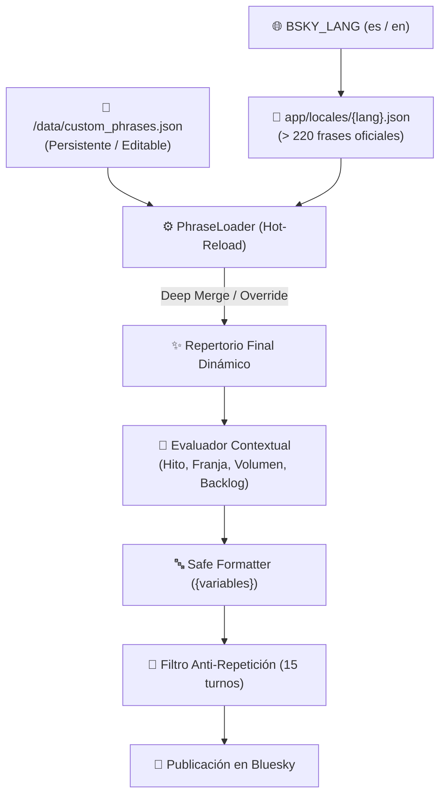

# ✍️ Motor de Frases Personalizadas y Multi-idioma (i18n)

`bsky-media-scrobbler` cuenta con un motor dinámico de redacción con soporte nativo para **múltiples idiomas** y **frases personalizadas** del usuario con **recarga en caliente** (cero tiempo de inactividad, sin reiniciar el contenedor).

---

## 🏗️ Arquitectura del Sistema



1. **Catálogo Base (`app/locales/`):**
   * Contiene los paquetes oficiales de frases organizados por categorías.
   * `locales/es.json` (Español) y `locales/en.json` (Inglés).
2. **Capa Personalizada (`/data/custom_phrases.json`):**
   * Ubicada en el volumen de datos persistente. Queda protegida contra actualizaciones del código o pulls de Git.
   * Modificable desde cualquier editor de texto o app móvil.
3. **Recarga en Caliente (`Hot-Reload`):**
   * El scrobbler verifica la fecha de modificación (`mtime`) del archivo en milisegundos. En cuanto guardas el archivo, los cambios surten efecto en el siguiente post sin reiniciar Docker.

---

## 📝 Variables Disponibles para Plantillas

Puedes redactar cualquier frase utilizando marcadores de posición `{variable}`. El formateador utiliza interpolación segura, por lo que una variable no existente o mal escrita no provocará errores.

### Variables en Series (`shows`)
| Variable | Descripción | Ejemplo |
| :--- | :--- | :--- |
| `{show_title}` | Nombre de la serie | `Separación`, `The Bear` |
| `{range_label}` | Código del episodio o rango de maratón | `T2E05`, `T1E01-E03` |
| `{season_num}` | Número de la temporada actual | `2` |
| `{first_ep}` | Primer episodio visto en la sesión | `1` |
| `{last_ep}` | Último episodio visto en la sesión | `3` |
| `{ep_count}` | Total de episodios vistos en la sesión | `3` |
| `{user_rating}` | Tu nota sobre 10 (si la has calificado) | `9.5` |
| `{months}` | Meses que la serie estuvo en pausa (en rescates de backlog) | `22` |
| `{years}` | Años que la serie estuvo en pausa | `1.8` |
| `{tracker_name}` | Nombre de la plataforma de seguimiento | `SIMKL`, `WeTrakr` |

### Variables en Películas (`movies`)
| Variable | Descripción | Ejemplo |
| :--- | :--- | :--- |
| `{movie_title}` | Título de la película | `Dune: Parte 2` |
| `{year}` | Año de estreno de la película | `2024` |
| `{year_str}` | Año formateado entre paréntesis | ` (2024)` |
| `{user_rating}` | Tu nota sobre 10 | `9` |
| `{tracker_name}` | Nombre de la plataforma de seguimiento | `SIMKL`, `WeTrakr` |

---

## 🎨 Modos de Uso en `custom_phrases.json`

### Modo A: Modo Suma (Por defecto)
Las frases que definas se añaden a las existentes en el sistema, ampliando la variedad orgánica de tus publicaciones:

```json
{
  "shows": {
    "finale": [
      "🏆 Se acabó lo que se daba con {show_title} (T{season_num}). ¡Vaya desenlace!",
      "🎬 Finiquitada la temporada {season_num} de {show_title}. ¿Quién más la ha visto?"
    ],
    "volume": {
      "mega_4": [
        "🔥 ¡Atracón legendario de {show_title} ({range_label})! Sin frenos."
      ]
    },
    "general": [
      "🍿 Enganchado a tope con {show_title} ({range_label})",
      "✨ Dosis diaria de {show_title} ({range_label})"
    ]
  },
  "movies": {
    "top_rating": [
      "🌟 Qué obra de arte irrepetible: {movie_title}{year_str}"
    ],
    "general": [
      "🎬 Otra película palomitera para la saca: {movie_title}{year_str}"
    ]
  },
  "engagement_questions": {
    "finale": [
      "¿La habéis visto? ¿Qué nota le dais vosotros? 👇"
    ]
  }
}
```

### Modo B: Modo Reemplazo Exclusivo (`replace`)
Si quieres que una o varias categorías utilicen **únicamente tus frases** y descarten por completo las que vienen de fábrica, añade sus rutas a la lista `"replace"`:

```json
{
  "replace": [
    "shows.finale",
    "movies.top_rating"
  ],
  "shows": {
    "finale": [
      "🏆 [Mi Canal] Fin de temporada oficial: {show_title} (T{season_num})"
    ]
  },
  "movies": {
    "top_rating": [
      "💎 Joya absoluta del cine: {movie_title}{year_str} ({user_rating}/10)"
    ]
  }
}
```

---

## 🗂️ Categorías Disponibles

### 1. Series (`shows`)
* `finale`: Finales de temporada (acompañados de valoración y pregunta de engagement).
* `caught_up`: Series al día con la emisión semanal:
  * `single_1`: 1 episodio visto.
  * `double_2`: 2 episodios.
  * `triple_3`: 3 episodios.
  * `marathon_4`: 4 o más episodios.
* `backlog_rescue`: Rescate de series tras más de 1.5 años (547 días) sin ver ningún episodio.
* `volume`: Sesiones según volumen:
  * `double_2`: 2 capítulos del tirón.
  * `triple_3`: 3 capítulos.
  * `mega_4`: 4 o más capítulos (atracón).
* `season_milestones`:
  * `show_premiere`: Inicio de serie nueva (T1E01).
  * `season_premiere`: Inicio de nueva temporada (T>1E01).
  * `penultimate`: Penúltimo episodio de la temporada.
  * `final_stretch`: Recta final de la temporada.
  * `mid_season`: Ecuador de la temporada.
* `time_of_day`: Madrugada (`night`), mañana (`morning`), sobremesa (`afternoon`) y noche (`evening`).
* `day_of_week`: Lunes (`monday`), entre semana (`midweek`), viernes (`friday`), sábado (`saturday`), domingo (`sunday`).
* `general`: Fondo de catálogo general continuo.

### 2. Películas (`movies`)
* `top_rating`: Puntuaciones de obra maestra (`>= 8.5/10`).
* `low_rating`: Puntuaciones flojas (`<= 5/10`).
* `era`:
  * `classic`: Películas clásicas anteriores al año 2000.
  * `recent`: Estrenos del año en curso o anterior.
* `time_of_day`: Madrugada (`night`), sobremesa (`afternoon`), noche (`evening`).
* `weekend`: Sesiones de fin de semana.
* `general`: Repertorio general.

### 3. Preguntas de Conversación (`engagement_questions`)
* `finale`: Preguntas para interactuar tras finalizar una temporada.
* `top_movie`: Preguntas tras ver una película destacada.
* `weekly`: Preguntas al pie del balance semanal.
* `monthly`: Preguntas al pie del balance mensual.
* `streak`: Preguntas al desbloquear una nueva racha.
